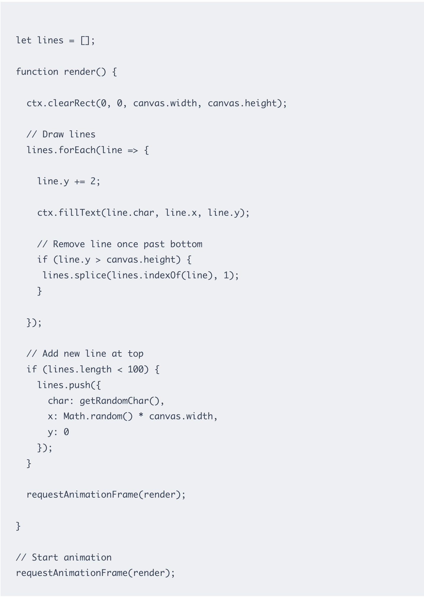

# Quiz-8
This is a Quiz for the IDEA9103

# Part1 : Imaging Technique Inspiration

In the Sci-film "The Matrix"，a classic opening scene shows Matrix Rain, which uses rotating letters and letters from top to bottom to simulate the rainfall. Considering there is a different colored cricle in the image , we can take inspiration from them to animate the cricles to similarly fall top to bottom. This approach serves two purposes : first , it is to simulate the natural growth patterns, and the other is to enhance the dynamic of the picture . Finally , makes the picture more dynamic.

# Part2: Coding Technique Exploration 

The following code uses an animation loop to build a continuous animation loop and designs a “line” array to maintain the animation‘s continuity. When the line reaches the bottom, it will be deleted and reappears. This approach can be applied to image creation to create random effects.

[The rain code](https://thelinuxcode.com/making-it-rain-code-matrix-style/)

